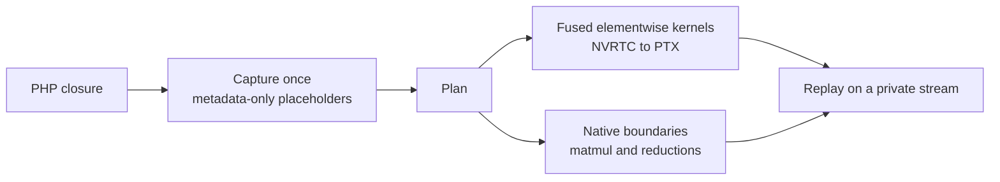

# PHP GPU Tensors

<p align="center">
    
</p>

<p align="center">
    <strong>GPU tensors, runtime-compiled CUDA kernels and fused tensor expressions for PHP.<br>No Python runtime required.</strong>
</p>

<p align="center">
    <a href="https://packagist.org/packages/lcmialichi/php-gpu-tensors"></a>
    
    
    <a href="LICENSE"></a>
</p>

Native PHP extension for GPU tensors and NVIDIA CUDA-accelerated numerical
workloads. Build tensor operations and machine-learning data pipelines in PHP,
move data explicitly between host and GPU, and compile custom CUDA C++ kernels
at runtime with NVRTC. Optionally fuse tensor expressions into compiled plans
that replay quickly, with asynchronous execution and CUDA Graph for compatible
plans.

**Status:** beta (`0.1.0-beta.4`) · Linux · PHP 8.1–8.5, NTS and ZTS · NVIDIA GPU
required. See [Validation status](#validation-status) for exactly what has been
tested on real GPUs.

## Highlights

- **GPU tensors.** `CudaArray` supports arithmetic, broadcasting, comparisons,
  `matmul()` (including batches), reductions, views and Python-style `slice()`.
- **Explicit data movement.** Packed buffers, `.npy` import and optional pinned
  host memory keep transfers cheap and visible.
- **Custom CUDA kernels.** Compile CUDA C++ at runtime with NVRTC and launch it
  from PHP, synchronously or asynchronously.
- **Optional kernel fusion.** Capture a PHP closure once, then replay it as fused
  GPU kernels. In a small training workload this was about 6× faster than eager
  execution with identical results (see [Results](#results)).
- **Clear scope.** A low-level GPU computing library, not a machine-learning
  framework: no automatic differentiation, no CPU fallback.

**Contents:**
[Quick look](#quick-look) ·
[Results](#results) ·
[Install](#install) ·
[Tensors](#gpu-tensors-in-php) ·
[Slicing](#python-style-slicing) ·
[Data pipelines](#data-pipelines-for-machine-learning) ·
[Custom kernels](#custom-kernels) ·
[Fusion](#optional-kernel-fusion) ·
[Streams and CUDA Graph](#streams-asynchronous-execution-and-cuda-graph) ·
[Training example](#real-training-with-fusion) ·
[API and limits](#api-and-limits) ·
[Validation status](#validation-status) ·
[Contribute](#contribute)

## Quick look

```php
use Cuda\CudaArray;
use Cuda\Fusion;

$a = CudaArray::ones([4]);
$b = CudaArray::full([4], 2.0);
$c = CudaArray::full([4], 3.0);

// Eager execution (default): one GPU operation per call.
$eager = $a + $b * $c;

// Fusion (opt-in): capture once, replay as fused GPU kernels.
$plan = Fusion::compile(fn($a, $b, $c) => $a + $b * $c, inputs: [$a, $b, $c]);
$fused = $plan->run($a, $b, $c);

print_r($fused->toArray()); // [7, 7, 7, 7]
```

Try a full training run on the GPU, written entirely in PHP:

```bash
php -n -d extension=./cuda_build-8.3/modules/cuda.so examples/08_gpu_classifier.php \
  --epochs=200 --batch-size=256 --learning-rate=0.05 --no-save
```

## Results

Measured on PHP 8.3 NTS with an NVIDIA GeForce MX570 A (4 GB, compute capability
8.6), driver 12.6 and CUDA runtime 12.3. The models are small, so these numbers
mostly show how much per-step overhead Fusion removes; they are not peak GPU
throughput and not a general-purpose GPU benchmark.

**Fusion vs. eager execution** on the same model and data, with identical
metrics (accuracy 77.29%, ROC AUC 0.853, same confusion matrix in both modes):

| Mode | Time per step | Patches per second | Training time (1,280 steps) |
| --- | ---: | ---: | ---: |
| Eager | 4.08 ms | 125,444 | 5.22 s |
| Fusion (compiled replay) | 0.66 ms | 776,251 | 0.84 s |

Workload: a small MLP (hidden size 256) on 32,768 training and 4,096 test patches
of [PatchCamelyon](https://github.com/basveeling/pcam) (CC0), using 480
handcrafted features per patch (RGB mean/std over an 8×8 grid and its central
4×4), batch size 512, 20 epochs, learning rate 0.02. This is a performance
demonstration, not a clinical model. The planner turned the 68 captured nodes of
the training step into 11 fused kernels plus 9 native boundaries (matmul and
reductions).

**End-to-end training example** ([`examples/08_gpu_classifier.php`](examples/08_gpu_classifier.php), a complete Multi-Layer Perceptron (MLP) for MNIST, Fashion-MNIST, or custom CSVs. It processes hundreds of thousands of samples per second using fused CUDA kernels, showcasing tensor operations, JIT compilation, math optimization (AdamW/SGD), and pure PHP data orchestration.

Full benchmark reports live in the
[benchmarks repository](#benchmarks).

## Install

### Requirements

| Need | Details |
| --- | --- |
| GPU and driver | CUDA-capable NVIDIA GPU; the host driver provides `libcuda.so.1` at runtime |
| Build toolchain | CUDA Toolkit (including NVRTC), C/C++ toolchain, `make`, `autoconf` |
| PHP | 8.1–8.5 development headers (`phpize`, `php-config`), NTS or ZTS |
| OS | Linux |

Building requires the toolkit; running requires the host driver.

### From source

```bash
git clone https://github.com/lcmialichi/php-gpu-tensors.git
cd php-gpu-tensors
./compile.sh
./run-tests.sh --require-gpu
php -n -d extension=./cuda_build-8.3/modules/cuda.so examples/01_basics_cuda_array.php
```

The build stays in `cuda_build-<PHP major.minor>/modules/cuda.so`; replace `8.3`
above with the PHP version used by `php-config`. To install the extension and its
INI configuration instead, run `./compile.sh --install` with permission to write
to your PHP extension/INI directories. To choose another PHP ABI:

```bash
PHP_BIN=php8.3 PHPIZE=phpize8.3 PHP_CONFIG=php-config8.3 ./compile.sh
PHP_BIN=php8.3 PHP_CONFIG=php-config8.3 ./run-tests.sh --require-gpu
```

Build options:

- `CUDA_HOME` if the toolkit is not at `/usr/local/cuda`.
- `CUDA_ARCH=sm_86` when cross-building.
- `CUDA_USE_CUBLAS=no ./compile.sh` to use the extension's built-in CUDA matrix
  kernels instead of cuBLAS (cuBLAS is used when available for compatible larger
  matrix products).

### With PIE 🥧

The extension is published as
[`lcmialichi/php-gpu-tensors`](https://packagist.org/packages/lcmialichi/php-gpu-tensors).

```bash
pie install lcmialichi/php-gpu-tensors:0.1.0-beta.4
```

Use `0.1.0-beta.4` or newer for the Fusion APIs and the training example
described here; older releases may not include them. PIE builds the native
extension for the selected PHP installation; it does not install an NVIDIA driver
or CUDA Toolkit. Those must already be available on the system, and GPU execution
additionally requires a compatible NVIDIA driver and a visible GPU.

### With Docker

Users with the NVIDIA Container Toolkit and a working host driver can build and
test in the development image:

```bash
docker compose run --rm php_cuda_dev bash -lc './compile.sh && ./run-tests.sh --require-gpu'
```

### Running the tests

`./run-tests.sh` runs CPU-side C tests and the PHP test suite. Use `--cpu-only` to
run only the host-side C tests in build environments without a GPU; this does not
validate CUDA execution. `--require-gpu` fails immediately when no GPU is visible,
instead of treating skipped GPU tests as success.

## GPU Tensors in PHP

```php
use Cuda\CudaArray;

$input = new CudaArray([[1, 2], [3, 4]], 'float32');
$weights = CudaArray::ones([2, 2]);
$output = $input->add($weights)->multiply(2);
$column_means = $input->mean(0);

print_r($output->toArray()); // [[4, 6], [8, 10]]
echo $output->dtype();       // float32
```

`CudaArray` holds GPU storage; operations return GPU tensors. `toArray()`
transfers to the CPU and expands all values into PHP arrays. Operations include
arithmetic, broadcasting, comparisons, `matmul()` (including batches), shape
views, and `sum()`, `mean()`, `min()`, `max()`, `prod()`, `argMax()`, and
`argMin()` with an optional axis. PHP arithmetic operators also dispatch to tensor
methods. `mean()` reduces all values when called without an axis, or reduces one
dimension when given an axis. It returns `float32` for `float32` input and
`float64` for `float64`, integer, and boolean input.

## Python-style slicing

`CudaArray::slice()` accepts a comma-separated expression, or one selector per
axis. Ranges have an exclusive stop, omitted bounds default to the axis limits,
and negative indices/bounds count from the end. Range bounds are clipped to the
axis size; individual indices outside the axis throw `InvalidArgumentException`.

```php
$batch = $tensor->slice('10:20, :');
$columns = $tensor->slice(':, 2:8:2');
$lastRows = $tensor->slice('-10:');
$row = $tensor->slice(3);       // Removes the first axis.
$oneRow = $tensor->slice('3:4'); // Keeps that axis with size 1.

// Dynamic equivalents: [start, stop] or [start, stop, step].
$batch = $tensor->slice([$start, $stop], null);
$columns = $tensor->slice(null, [2, 8, 2]);
```

Integers remove axes; `null`, `':'`, omitted axes and `slice()` with no arguments
select the full extent. Steps must be positive integers no larger than `INT_MAX`.
Zero/negative steps, ellipsis, new axes, index lists and executable expressions
are not supported. Expressions are parsed as integers/ranges, never evaluated as
PHP.

<details>
<summary>Views, empty ranges and legacy syntax</summary>

A fully indexed tensor has shape `[]` and size 1; `toArray()` and
`toHost()->toArray()` represent it as a one-element array.

Outside Fusion, slices are zero-copy views with shared storage: writes through a
view affect its parent, and the parent remains alive while the view is retained.
Host transfers pack strided views into contiguous host storage. Row assignments
involving strided tensors stage the source on the host before writing, preserving
overlapping-source correctness; this is not a GPU-only bulk scatter operation.
Fusion captures slice index transformations without materializing during capture;
returned compiled/scoped outputs use the existing independent-output storage
contract.

Empty ranges are supported, preserving the remaining shape: `[0, 4]` converts to
`[]`, whereas `[3, 0]` converts to `[[], [], []]`. Elementwise operations, casts,
transfers, reshape/transpose and matmul handle zero elements. Sum/product over an
empty axis return 0/1; mean returns NaN. Min/max and arg reductions throw when an
empty reduced axis would produce values, because no identity/index exists. An
empty non-reduced output remains empty. Packed-buffer imports accept zero
dimensions; materialized empty results support serialization.

The legacy `__invoke()` and `[]` selection syntax remain unchanged, including
their inclusive ranges. Do not interpret their bounds as the new exclusive
`slice()` bounds.

</details>

## Data pipelines for machine learning

Use this extension to build GPU-accelerated numerical steps into PHP
applications: tensor arithmetic, matrix multiplication, broadcasting, reductions
such as `mean()`, and custom CUDA kernels. These primitives support
machine-learning data preparation, inference and small training loops while the
data remains in NVIDIA GPU memory.

This is a low-level GPU computing library, not a complete machine-learning
framework. The training example implements backpropagation explicitly; automatic
differentiation and Python interoperability are not provided.

For data already in packed row-major bytes, avoid creating individual PHP
scalars. `fromFile()` reads raw bytes, whereas `fromNpy()` parses NumPy's `.npy`
format:

```php
use Cuda\CudaArray;
use Cuda\HostArray;

$bytes = pack('g*', 1, 2, 3, 4); // little-endian float32
$host = HostArray::fromBuffer($bytes, [2, 2]);
$gpu = $host->toGpu();
$result = CudaArray::where(
    CudaArray::fromBuffer(pack('C*', 1, 0), [2], 'bool'),
    $gpu,
    CudaArray::zeros([2, 2])
);
$cpuCopy = $result->toHost();
$raw = $cpuCopy->toBuffer();

// Flat PHP values can be imported without constructing nested rows.
$matrix = CudaArray::fromFlatArray([1, 2, 3, 4], [2, 2]);
// Direct binary download avoids both PHP scalar expansion and an extra host-to-string copy.
$bytes = $matrix->toBuffer();
```

The constructor validates rectangular numeric input while converting it, with
specialized packed-array loops for each dtype. Integer, float and boolean values
are accepted; array keys are ignored in iteration order. Ragged arrays,
nonnumeric values and excessive nesting throw `Cuda\InvalidArgumentException`;
empty rectangular arrays are supported. `fromFlatArray()` additionally verifies
that the flat element count matches the explicit shape.

`toArray()` preserves nested row-major PHP lists, using preallocated packed
arrays. Large contiguous imports use 4 MiB staging windows; PHP-array exports
use at most 32 MiB to avoid excessive CUDA copy calls, rather than a temporary
buffer the size of the tensor. Large or sparse
strided downloads are packed on the GPU before copying; small strided results
use a host gather. Scalars remain one-element arrays, and empty axes are
preserved. These optimizations do not remove the memory cost of one PHP value
per element: prefer `toBuffer()` when consuming binary data and keep intermediate
tensors on the GPU.

For reproducible constructor/download measurements, run
`examples/09_transfer_benchmark.php --output=transfer.json` with the extension
loaded. Add `--large` to include the 33,554,432-element case and allow enough PHP
memory (`-d memory_limit=-1`). Add `--random` for random GPU download inputs.
The runner prepares inputs outside timing and
reports materialization, destruction and end-to-end medians separately, plus
retained PHP heap bytes; it does not claim to isolate CUDA copy time.

`HostArray` is an alias of `Cuda\ContiguousArray`, a contiguous CPU tensor. Pass
`pinned: true` to its constructor or `fromBuffer()` for page-locked host storage
when repeated transfers justify the extra host memory. `where()` broadcasts its
three inputs; its mask treats nonzero values as true, and its two value tensors
must have the same dtype. `.npy` imports support C-order little-endian numeric and
boolean arrays; Fortran order and big-endian data are rejected.

## Custom kernels

Register the CUDA kernel's argument metadata, compile to PTX, then launch with
explicit grid and block dimensions:

```php
use Cuda\Compiler;
use Cuda\CudaArray;

$source = <<<'CUDA'
extern "C" __global__ void scale(float *data, int factor, int count)
{
    int index = blockIdx.x * blockDim.x + threadIdx.x;
    if (index < count) data[index] *= factor;
}
CUDA;

$compiler = new Compiler(source: $source);
$compiler->kernel('scale', [
    ['name' => 'data', 'type' => 'array', 'dtype' => 'float32'],
    ['name' => 'factor', 'dtype' => 'int32'],
    ['name' => 'count', 'dtype' => 'int32'],
]);
$module = $compiler->compile();
$module->initialize();

$data = CudaArray::ones([512]);
$module->launch('scale',
    args: [$data, 3, 512],
    config: ['block' => [256, 1, 1], 'grid' => [2, 1, 1]]
);
print_r(array_slice($data->toArray(), 0, 4)); // [3, 3, 3, 3]
```

`launch()` synchronizes; `launchAsync()` returns an operation ID for `sync()` or
`wait()`. Keep tensors alive until asynchronous work finishes. See
[the JIT examples](examples/04_custom_jit_kernels.php) and
[asynchronous execution](examples/05_jit_async_execution.php).

## Optional kernel fusion

Eager execution remains the default. Fusion is explicitly opt-in: existing code
keeps using eager execution unless capture is enabled.



`Fusion::run()` captures tensor operations inside a callback and returns
materialized `CudaArray` outputs:

```php
use Cuda\Fusion;

$result = Fusion::run(fn() => $tensorA + $tensorB * $tensorC);
$eager = Fusion::run(fn() => $tensorA + $tensorB * $tensorC, enabled: false);
```

For repeated execution, compile a specialized plan once:

```php
$graph = Fusion::compile(
    fn($a, $b, $c) => $a + $b * $c,
    inputs: [$tensorA, $tensorB, $tensorC]
);
$result = $graph->run($tensorA, $tensorB, $tensorC);
$other = $graph->run($otherA, $otherB, $otherC);
print_r($graph->getStats());
print_r($graph->getPlan());
echo $graph->getSource();
```

What to know at a glance:

- **Fused:** addition, subtraction, multiplication, division, unary operations,
  comparisons, `where()`, safe `astype()` conversions and
  reshape/transpose/slice index transformations.
- **Execution boundaries:** reductions, `matmul()` (currently float32) and powers
  run on existing kernels; the fused kernels run in dependency order around them.
- **Replay:** the PHP callback is not invoked again after compilation, and input
  values and pointers can change between executions.
- **Inspection:** `getStats()`, `getPlan()` and `getSource()` show what the planner
  produced; for `$a + $b * $c` the plan has one fused kernel and no intermediate
  data buffers.

<details>
<summary>Fusion reference: compile and replay, fusion rules, capture limits and caching</summary>

**Compile and replay.** Compilation invokes the callback once with metadata-only
placeholders. Replay does not invoke PHP callback code again. Inputs must match the
example shapes, dtypes and strides, and execution must use the compilation device
and CUDA context. Input values and pointers can change between executions; keep the
device/context alive until the graph is released. Tensors captured by a closure are
retained by the graph; use callback parameters for replaceable inputs.

**What fuses.** Addition, subtraction, multiplication, division, unary operations
and comparison methods fuse into elementwise kernels, with broadcasting,
strided/view inputs, scalar operands and dtype promotion. Each node converts to its
own result dtype, preserving intermediate rounding/narrowing. Generated kernels use
the eager backend's fast-math settings but disable cross-node FMA contraction.
`where()`, safe explicit `astype()` conversions and reshape/transpose/slice index
transformations also fuse. Safe casts work in eager execution too, using the same
generated conversion kernel; unsafe narrowing retains the existing rejection
policy.

**Boundaries and planning.** Reductions, `matmul()` (currently float32) and powers
are execution boundaries using existing kernels. All generated elementwise kernels
in a plan are compiled together through the existing `Compiler` NVRTC
infrastructure, then executed in dependency order around these boundaries.
Expressions split at a weighted cost budget of 32 (math functions, index transforms
and float64 have higher cost). Shared expensive expressions can be materialized
instead of recomputed. Pure repeated binary/unary/cast nodes are deduplicated, and
unreachable nodes are not included in compiled plans. Capture is limited to 512
nodes.

**Outputs and diagnostics.** Callbacks can return tensors or nested arrays of
tensors, preserving array keys. Up to four adjacent independent outputs with the
same shape can share a kernel. Other outputs use separate kernels; fusion does not
promise one kernel for an entire callback. `getPlan()` reports step kinds, output
counts and the reason for each materialization, including zero-copy `view` steps
for layouts consumed by compatible native operations. `getStats()` exposes planned
fused kernels, boundary steps, intermediate buffer count, scratch reuse and
successful replay count.

**Capture limits.** During `run()`, CPU reads, legacy slicing (`__invoke()` and
`[]`), serialization and operations not captured by the planner materialize their
required inputs and continue eager execution; later elementwise operations can form
a new segment. During `compile()`, reads of placeholder data are rejected rather
than specializing on example values. Shape, stride and dtype queries do not execute
kernels. Nested capture, Fiber switching, tensor mutation (including compound
assignments), custom kernel launches and device changes/reset are prohibited during
capture. Exceptions restore eager execution; escaped tensors from an aborted capture
cannot be read. `run()` remains synchronous.

**PTX cache.** Generated PTX is cached per PHP request/thread, with LRU eviction at
16 entries or 16 MiB. Keys include generated source (operations, constants, dtypes
and layouts), compute capability and CUDA driver/runtime versions, not input
pointers. `Fusion::getCacheStats()` reports hits, misses, compilations and
evictions. `Fusion::clearCache()` drops PTX without invalidating existing graphs.
`compile()` also avoids repeated planning and module loading during replay.

</details>

## Streams, asynchronous execution and CUDA Graph

Plans containing generated kernels, matmul and reductions run on a private
nonblocking stream. Reduction descriptors are kernel parameters rather than shared
global state, so concurrent replays cannot overwrite each other's shapes.

```php
$graph = Fusion::compile(
    fn($a, $b, $c) => ($a + $b * $c)->sqrt(),
    [$tensorA, $tensorB, $tensorC],
    cudaGraph: true
);
$pending = $graph->runAsync($tensorA, $tensorB, $tensorC);
$finished = $pending->isFinished(); // Query without waiting.
$result = $pending->wait();        // Synchronize and retrieve outputs.
```

`cudaGraph: true` opts into a CUDA Graph executable for compatible plans. Kernel
parameters are updated for new input/output pointers before each launch.
`getStats()['backend']` is `cuda-graph`, `stream` or `native`.

| Plan contains | Stream and `runAsync()` | CUDA Graph |
| --- | :---: | :---: |
| Generated kernels only | ✅ | ✅ |
| Matmul / reductions | ✅ | not yet |
| Power boundaries | ❌ (synchronous native executor) | ❌ |

Check `cudaGraphCompatible` and `cudaGraphIncompatibility` to distinguish graph
support from `asyncCompatible`. Power boundaries report the reason in
`incompatibility` and reject `runAsync()`. CUDA failures are reported rather than
hidden behind fallback.

<details>
<summary>Concurrency rules, scratch memory and profiling</summary>

Synchronous compiled replay keeps a reusable stream, readiness event and scratch
workspace; async replays use separate scratch storage. Slots are planned by last
consumer, including native consumers and aliased views. Returned outputs always
have independent storage across replays. Scratch remains allocated until the graph
is released and counts toward the configured GPU memory budget.

Stream plans allow concurrent `runAsync()` calls. A CUDA Graph executable allows
only one outstanding replay: call `wait()` (or release the execution) before
replaying that graph again. A completion query alone does not release the
execution's retained resources. Inputs and closure-captured tensors remain alive
until completion is collected. While an execution is outstanding, tensor mutation,
custom kernel launches and device changes/reset are blocked. Inputs must be ready
before submission; independent custom async producer streams still require their
existing synchronization contract.

Repeated `wait()` calls return the same outputs. Destroying a pending
`FusionExecution` synchronizes before releasing storage. Execution submission
preallocates tensors and can incur allocation synchronization; asynchronous kernel
submission does not imply a zero-blocking PHP call. Device shape/stride metadata is
allocated lazily, only for kernels that need it. Generated kernels, reductions,
unaries and matmul use compiled or host descriptors instead of uploading metadata
for every result tensor.

Optional synchronous replay phase timing:

```php
$graph->setProfiling(true); // Enable timing and reset phase totals.
$result = $graph->run($tensorA, $tensorB, $tensorC);
print_r($graph->getStats());
$graph->setProfiling(false); // Disable timing and reset phase totals.
```

`profiledExecutions`, `bindTimeNs`, `executeTimeNs` and `collectTimeNs` accumulate
successful synchronous `run()` calls only. Execution timing includes preparation,
submission and waiting; it is not isolated GPU kernel time. Profiling is off by
default. `tensorAllocations` counts replay-created data tensors, not pool cache
misses or CUDA allocation calls. `workspaceBuffers` counts retained scratch slots;
`bufferReuses` and `synchronizations` are cumulative replay counters.

Run the focused comparison of eager, cached scoped, stream replay and CUDA Graph
replay with:

```sh
php -n -d extension=./cuda_build-8.3/modules/cuda.so \
  examples/07_fusion_graph.php --benchmark --elements=65536 --iterations=100
```

The example validates output bytes, reports cold/cache compilation costs and
end-to-end timings, and does not assume CUDA Graph is faster for every workload.

</details>

## Real training with Fusion
[`examples/08_gpu_classifier.php`](examples/08_gpu_classifier.php )trains a deep MLP classifier on real datasets (MNIST, Fashion-MNIST, or CSV) without custom CUDA source or environment switches:

- Parses and normalizes dataset files directly in PHP.
- Packed float32 batches are uploaded once with ``fromBuffer()`` and kept on the GPU, including their transpose views.
- Forward pass, numerically stable softmax cross-entropy, backward pass, and optimizer (AdamW or SGD) steps are compiled once per batch shape and replayed with new parameter tensors
- Matmul/reduction boundaries and generated elementwise kernels share a private stream, with minimal synchronization.
- Loss is transferred only on reporting epochs, outputting a colorful CLI report including macro-F1 score and confusion analysis

```sh
php -n -d extension=./cuda_build-8.3/modules/cuda.so examples/08_gpu_classifier.php \
  --dataset=mnist --epochs=40 --batch-size=128 --optimizer=adam
```

Defaults are MNIST, 512-256 hidden layers, 40 epochs, batch size 128, and the AdamW optimizer. Every default run trains from deterministic initial weights. Omit ``--no-save`` to save parameters after successful evaluation; ``--load`` explicitly evaluates a compatible saved model instead of training. Dataset and model files are saved to the script's origin directory and are ignored by Git. The script reports one-time uploads, compilation, training throughput, and detailed evaluation metrics. Add ``--profile`` to print per-plan timing, allocation, scratch, and synchronization counters after training, or ``--predict-index=N``to showcase inference on a specific sample.

## API and limits

| API | Purpose |
| --- | --- |
| `Cuda\CudaArray` | GPU allocation, tensor math, reductions, views, imports and `where()` |
| `Cuda\HostArray` / `Cuda\ContiguousArray` | CPU storage, packed buffers, optional pinned memory and `toGpu()` |
| `Cuda\Fusion` / `Cuda\FusionGraph` | Optional expression capture, compiled replay, PTX cache and plan diagnostics |
| `Cuda\FusionExecution` | Pending compatible execution, completion query and synchronized result collection |
| `Cuda\Compiler` / `Cuda\CompiledModule` | NVRTC compilation, cached PTX, synchronous and asynchronous kernels |
| `cuda_get_device_count()` and other `cuda_*` functions | Device selection, properties, memory and synchronization |
| `Cuda\Exception` | Base class for runtime, argument, allocation and compilation errors |

The annotated signatures are in [class stubs](stubs/cuda.stub.php) and
[device function stubs](stubs/cuda_methods.stub.php); runnable examples live in
[examples](examples/README.md).

**Current limits:**

- NVIDIA GPUs only, on Linux. GPU data has no CPU fallback.
- No automatic differentiation; backpropagation is written explicitly.
- `astype()` supports safe dtype conversions.
- The core API baseline is frozen at `0.1.0`, and the current release is beta.
- Matmul/reduction plans support async replay, but not CUDA Graph yet; power
  boundaries still require synchronous execution.

## Validation status

The core API has a frozen `0.1.0` baseline; eager execution remains the default
and Fusion is explicitly opt-in. Build and CPU checks do not substitute for GPU
runtime validation on each PHP version and thread mode.

| PHP / mode | GPU | What was validated |
| --- | --- | --- |
| 8.3 NTS | GeForce MX570 A | Current release: 41 GPU tests (including gradient/lifetime regressions) plus an Optdigits training check |
| 8.3 and 8.5 NTS | GeForce MX570 A | Current source: 41 GPU PHPT tests on each runtime, including constructor validation, typed exports, strided packing and staging-window boundaries; CPU/API checks also passed |
| 8.5 NTS and ZTS, 8.1 ZTS | RTX A2000 | Earlier tensor/JIT validation only; does not cover the latest Fusion changes |
| All ten PHP 8.1–8.5 × NTS/ZTS combinations | none | Builds and CPU/API checks for this release |

**Tested on another GPU, PHP version or CUDA version?** Reports are very welcome:
please [open an issue](https://github.com/lcmialichi/php-gpu-tensors/issues) with
your PHP version, thread mode, GPU, driver and CUDA versions, and whether
`./run-tests.sh --require-gpu` passed.

## Contribute

Contributions can be code, tests, documentation, runnable examples, or reports from
another PHP/CUDA/GPU combination. Browse
[open issues](https://github.com/lcmialichi/php-gpu-tensors/issues),
[report a bug](https://github.com/lcmialichi/php-gpu-tensors/issues/new?template=bug_report.yml),
or [propose a feature](https://github.com/lcmialichi/php-gpu-tensors/issues/new?template=feature_request.yml).
Start with the [contribution guide](CONTRIBUTING.md); documentation, examples, and
host-side tests are possible without an NVIDIA GPU.

For possible directions, see the [roadmap](ROADMAP.md). A feature does not need to
be listed there to be worth discussing.

## Benchmarks

The benchmark suite is maintained in the separate
[PHP GPU Tensors Benchmarks repository](https://github.com/lcmialichi/php-gpu-tensors-benchmarks).
It includes focused `--matmul`, `--import` and `--fusion` runs, JSON/HTML reports,
and a [beta.4 full-suite report](https://github.com/lcmialichi/php-gpu-tensors-benchmarks/blob/main/published-reports/beta4-php83-mx570/README.md)
covering 398 cases on PHP 8.3 NTS and an MX570 A, including Fusion replay and
slicing. Earlier results include a
[published PHP 8.5 NTS vs ZTS comparison](https://github.com/lcmialichi/php-gpu-tensors-benchmarks/blob/main/published-reports/php85-nts-vs-zts/README.md),
as well as a [full-suite benchmark report](https://github.com/lcmialichi/php-gpu-tensors-benchmarks/blob/main/published-reports/php85-nts-vs-zts-full/README.md)
covering 368 cases across five workload groups with downloadable raw reports.

## License

Licensed under the [MIT License](LICENSE).